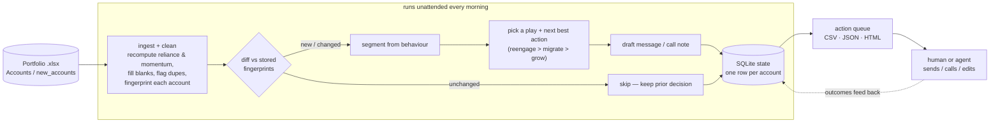

# Fleek Retention Agent

A tool for Fleek's GTM–Retention team. It takes your portfolio of account-managed
and self-serve buyers, works out from **behaviour** (not the ownership label) who
needs attention, decides the **next best action** per account, and **drafts** the
message or call note so an AM — or an agent — can just act. Re-run it against a
new batch and it updates the book in place, without reprocessing or duplicating
anything it has already seen.

It's a **process, not a dashboard**: point it at the same file twice and the
second run does nothing; drop in `new_accounts` and only the genuinely new or
changed accounts are touched.

## The two problems (and a guardrail)

1. **Reduce brokering reliance** (account-managed). Some high-spending
   account-managed customers barely touch the product — the AM is placing their
   orders. Find them from behaviour (high recomputed reliance + low app/PDP/offer
   activity) and move them to self-serve without losing the spend.
2. **Grow self-serve spend** (self-serve). Find self-serve accounts with headroom
   (high intent + low spend, or handpick-only) and nudge each toward the one
   feature most likely to move its basket: **bundles**, **video**, **chat**, or
   **build-a-bundle**.
3. **Retention guardrail** (`reengage`). A material account that's gone quiet or
   is sliding gets stabilised *first* — there's no point migrating or upselling a
   churning account. This play takes precedence over the other two.

## What it decided on the real 300-account book

| | |
|---|---|
| **128 of 210** account-managed accounts actually **behave self-serve** | label ≠ behaviour, so we never trust the label |
| **74** genuinely broker-reliant; **26** material enough to migrate now | **£289k** of GMV currently riding on a human |
| **35** material accounts churning (`reengage`) | **£298k** of GMV at risk |
| **122** self-serve growth nudges | video 43 · build-a-bundle 36 · bundles 25 · chat 18 |
| **85 / 300** accounts had a `broker_reliance_pct` that disagreed with their order counts | recomputed from counts, flagged |

## Quickstart

```bash
python3 -m venv .venv && source .venv/bin/activate
pip install -r requirements.txt
cp .env.example .env            # optional: add ANTHROPIC_API_KEY for LLM-written drafts

# Drop Fleek's workbook in first (it's not committed — see Data below):
#   data/raw/Fleek_-_Retention_Case_Study_-_Portfolio_Data.xlsx

python cli.py run data/raw/Fleek_-_Retention_Case_Study_-_Portfolio_Data.xlsx
open out/index.html             # the ranked action queue
```

Then prove it keeps running:

```bash
# same file again -> 0 new, 0 changed, everything skipped (idempotent)
python cli.py run data/raw/Fleek_-_Retention_Case_Study_-_Portfolio_Data.xlsx

# the second batch -> 45 new + 5 changed overlaps, no duplicates
python cli.py run data/raw/Fleek_-_Retention_Case_Study_-_Portfolio_Data.xlsx --sheet new_accounts

python cli.py status            # book state + run history
```

Add `--llm` to have Claude write the drafts (needs `ANTHROPIC_API_KEY`); without
it, drafts are templated — real and personalised, just not model-written.

```bash
pip install -r requirements-dev.txt && python -m pytest -q   # 12 tests
```

## How it works



**Where a person or agent steps in.** Everything in the `AUTO` box runs with no
human: cleaning, segmentation, the play decision, and the draft. A person (or a
messaging agent) only enters at the end — to send the drafted message, make the
call, or tweak a draft. The `reason` on every row is there so that hand-off is a
5-second read, not a re-investigation. The dashed line is where this would grow
next: capturing whether the action landed, to reweight the plays (the priors in
`data/plays/*.md` become learned).

### Module map

```
retention_agent/
  config.py        every threshold, each with a one-line commercial rationale
  models.py        pydantic domain types (Account, Decision, RunReport)
  ingest.py        load + clean (vectorised pandas); recompute the signals we
                   don't trust; fingerprint each account
  segment.py       behavioural segmentation + health overlay (label-blind)
  plays.py         which play fires, the NBA, the feature decision tree, £ prize
  draft.py         templated drafts (default) + optional LLM rewrite
  llm.py           thin Anthropic wrapper; degrades to None (never throws)
  store.py         SQLite state + the new/changed/unchanged diff (idempotency)
  orchestrator.py  the loop: ingest -> diff -> decide -> draft -> persist -> report
  report.py        CSV / JSON / self-contained HTML outputs
cli.py             run / status / reset
data/plays/        the three plays as markdown skills (edit behaviour here)
```

### Reading behaviour, not labels

The ownership field is **never** an input to segmentation. We classify on:

- **broker reliance**, recomputed as `manual_orders / orders_6m` — the provided
  `broker_reliance_pct` disagreed with the counts on 85/300 accounts, so we trust
  the counts and flag the gap;
- **self-serve activity** (`app_active_days_6m`, `pdp_views_6m`) as the
  counter-evidence: high reliance *and* low activity = a person is the buyer.

That's why 128 account-managed accounts land in a self-serve segment — they have
an AM, but they buy for themselves. Thresholds live in [config.py](retention_agent/config.py),
one place, each with a rationale.

### Built to keep running, and to scale

- **Idempotent.** Each account stores the fingerprint of the data its decision
  was made against. A re-run diffs the incoming batch into new / changed /
  unchanged and only touches the first two. `account_id` is the primary key, so
  writes are upserts — the same account can never duplicate.
- **Scale.** Cleaning and signal derivation are vectorised pandas; segmentation
  and decisioning are a single O(n) pass; SQLite shrugs at 30k rows. The test
  suite decides a **synthetic 30,000-account book in a few seconds**. The only
  per-account external cost is LLM drafting — off by default, cached by
  fingerprint when on, and the obvious next step is the Batch API.

## The debrief

**First 30 days.** *Week 1:* run it on the inherited book, work the top of the
action queue by £ at stake — the £298k of at-risk GMV (`reengage`) first, then
the £289k riding on a human (`migrate`). *Week 4:* it's the morning job — I open
`out/index.html`, the new/changed accounts are already decided and drafted, and I
spend my time on the handful of big accounts that genuinely need a human, not on
re-triaging the whole book.

**Migration.** The 26 material broker-reliant accounts, ranked by GMV-on-a-human.
Warm ones (they already browse) get a one-tap in-app reorder nudge; cold ones get
a 10-minute guided first order with their SKUs pre-loaded. The AM stays a safety
net for the first order so spend doesn't wobble.

**Growth.** The 122 self-serve accounts with headroom, each matched to one
feature by behaviour: handpick-only → bundles (basket size), offers-but-no-orders
→ video (close on a call), heavy-browser-not-talking → chat, otherwise
build-a-bundle. One nudge per account, not a menu.

**Health.** Healthiest = self-serving, engaged, spending, stable — the
`self_serve_healthy` segment on a flat-or-up trend. We leave them alone (117
accounts get *no* action on purpose). The unhealthy ones are the 35 material
accounts that are dormant or sliding, which is exactly why `reengage` outranks
everything else.

## How I used AI

Built with **Claude Code**. Where it helped: profiling the messy data fast
(spotting that `broker_reliance_pct` disagrees with the counts and that
`gmv_trend_pct` is half-blank because it divides by a zero Sep), scaffolding the
vectorised pandas and the SQLite store, and drafting the outreach copy. Where I
drove: the segmentation thresholds and their rationale, the play precedence
(`reengage > migrate > grow`), the feature decision tree, and gating health on
account materiality once the first cut flagged half the book as "dormant" (lumpy
low-frequency buyers, not churn). The tool itself uses Claude the same way — to
write drafts — behind a fingerprint cache and a heuristic fallback, so it never
depends on the model being up. Full commit history shows the build order.

## Data

Not committed. Fleek's portfolio workbook is real, anonymised customer data, so
it stays out of git even though this repo is public. Put it at
`data/raw/Fleek_-_Retention_Case_Study_-_Portfolio_Data.xlsx` before running. Two
tabs (`Accounts`, `new_accounts`) plus a `Readme` column dictionary. The tool
reads GBP figures and treats blanks as genuinely missing.
