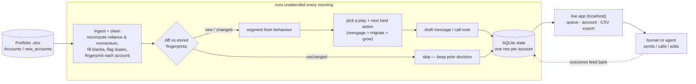

# Fleek Retention Agent

A tool for Fleek's GTM–Retention team. It takes your portfolio of account-managed
and self-serve buyers, works out from **behaviour** (not the ownership label) who
needs attention, decides the **next best action** per account, and **drafts** the
message or call note so an AM — or an agent — can just act. Re-run it against a
new batch and it updates the book in place, without reprocessing or duplicating
anything it has already seen.

It's a **process, not a dashboard**: point it at the same file twice and the
second run does nothing; drop in `new_accounts` and only the genuinely new or
changed accounts are touched.

## The two problems (and the lifecycle around them)

1. **Reduce brokering reliance** (account-managed). Some high-spending
   account-managed customers barely touch the product — the AM is placing their
   orders. Find them from behaviour (high recomputed reliance + low app/PDP/offer
   activity) and move them to self-serve without losing the spend.
2. **Grow self-serve spend** (self-serve). Find self-serve accounts with headroom
   and nudge each toward the one feature most likely to grow it: **video**,
   **chat**, **bundles**, or **build-a-bundle** — matched to the account's
   blocker, not one-size-fits-all (see the feature logic below).

Two more plays complete the account lifecycle around those:

3. **Onboard** (new). Every account under 5 months has zero AM support and stalls
   after one order — an onboarding gap. New accounts are flagged for proactive
   early customer success and ranked on *ramp potential*, not their tiny spend.
   (High-touch to activate now, wean to self-serve later — the lifecycle, not a
   contradiction.)
4. **Reengage** (guardrail). A material account that's gone quiet or is sliding
   gets stabilised *first* — no point migrating or upselling a churning account.

The full priority order is `reengage → onboard → migrate → grow → leave alone`:
stabilise the churning, activate the new, wean the reliant, grow the healthy.

## What it decided on the real 300-account book

| | |
|---|---|
| **ACC-001 alone is 20% of the book** (top 10 = 51%, top 30 = 72%) | one whale + a short head + a long 270-account tail — the whale is human-owned, not queued |
| **80.7% of GMV** flows through the **74 broker-reliant** accounts (just 25% of the book) | the book's core scalability risk — migration is where the money is |
| **128 of 210** account-managed accounts actually **behave self-serve** | label ≠ behaviour, so we never trust the label |
| **63 new accounts (<5mo) have 0 manual orders** and stall at ~1 order | onboarding gap — the AM relationship forms ~12mo too late; flagged for early CS |
| **36** material broker-reliant accounts to migrate now | **£364k** of GMV riding on a human (exposure, not at-risk) |
| **22** material accounts genuinely churning (`reengage`) | **£120k** of *forward* GMV at risk (run-rate lost, not lifetime) |
| **125** self-serve growth nudges | video 48 · build-a-bundle 42 · chat 18 · bundles 17 |
| **85 / 300** accounts had a `broker_reliance_pct` that disagreed with their order counts | recomputed from counts, flagged in the decision |
| Whole book ranked by **risk-adjusted expected value** | **£80k** of expected 6-month impact, honestly comparable across the three plays |
| **~10%** of would-be-actioned accounts held back as a **control group** | so growth lift can be measured, not assumed (leaves ~162 in the AM's queue) |

## Quickstart

```bash
python3 -m venv .venv && source .venv/bin/activate
pip install -r requirements.txt
cp .env.example .env            # optional: add ANTHROPIC_API_KEY for LLM-written drafts

uvicorn server.app:app --port 8000    # then open http://localhost:8000
```

Then **Upload .xlsx** in the app to load a workbook (or drop one into `data/raw/`
first — it's not committed, see Data below — and it's picked up automatically).

Everything happens in the browser: hit **Run · Accounts** to process the book,
browse the ranked action queue, search / sort / filter by play, click any account
for its signals, reason, next best action and drafted message, then **Run ·
new_accounts** to prove it picks up the batch without duplicating. **Log outcomes**
(Responded / Converted) on an account and they feed the learning loop. There are
no static files — the SQLite store is the source of truth and the app renders it
live. Tick **use LLM drafts** to have Claude write the outreach (needs
`ANTHROPIC_API_KEY`); off, drafts are templated but real.

### Headless / cron (same engine, no browser)

The morning job can run without the UI — it updates the same `data/state.db`:

```bash
python cli.py run data/raw/Fleek_-_Retention_Case_Study_-_Portfolio_Data.xlsx
python cli.py run data/raw/Fleek_-_Retention_Case_Study_-_Portfolio_Data.xlsx    # again -> all skipped (idempotent)
python cli.py run data/raw/Fleek_-_Retention_Case_Study_-_Portfolio_Data.xlsx --sheet new_accounts   # 45 new + 5 changed
python cli.py status
python cli.py calibrate data/raw/Fleek_-_Retention_Case_Study_-_Portfolio_Data.xlsx   # empirical priors + tiers
python cli.py run <workbook> --export queue.csv   # optional CSV dump of the action queue
```

```bash
pip install -r requirements-dev.txt && python -m pytest -q   # 33 tests
```

### Deploy to Vercel

The same FastAPI app runs as a serverless function — `api/index.py` re-exports it
and `vercel.json` rewrites every route to it, so there's no separate build:

```bash
vercel        # preview
vercel --prod # production
```

Two things differ on a serverless host, both handled automatically:

- **Storage is ephemeral.** The project filesystem is read-only except `/tmp`, so
  the state DB and uploaded workbooks go there (`config.py` switches on the
  `VERCEL` env var). A cold start wipes them — fine for a demo or single session.
  To make the book durable, point `RETENTION_DB` at a hosted database and swap the
  store backend; nothing else changes.
- **No workbook is baked in** (Fleek's data stays out of git). Use **Upload .xlsx**
  in the app to load one, then **Run**.

Set `ANTHROPIC_API_KEY` in the Vercel project's env vars if you want LLM drafts.

## How it works



**Where a person or agent steps in.** Everything in the `AUTO` box runs with no
human: cleaning, segmentation, the play decision, and the draft. A person (or a
messaging agent) only enters at the end — to send the drafted message, make the
call, or tweak a draft. The `reason` on every row is there so that hand-off is a
5-second read, not a re-investigation. The dashed line is the learning loop, and
it's **closed**: the `outcomes` table logs whether each action landed, a ~10%
deterministic **holdout** (control group, no outreach) gives a baseline to
measure against, and at the start of every run [`learning.apply`](retention_agent/learning.py)
blends the EV priors toward the observed rates (shrinkage — see below) so the
next run re-ranks on evidence, not just assumptions.

### Module map

```
retention_agent/
  config.py        every threshold, each with a one-line commercial rationale
  models.py        pydantic domain types (Account, Decision, RunReport)
  ingest.py        load + clean (vectorised pandas); recompute the signals we
                   don't trust; fingerprint each account
  segment.py       behavioural segmentation + health overlay (label-blind)
  plays.py         which play fires, the NBA, the feature decision tree, EV prize
  analysis.py      calibrate(): derive the growth priors from the book itself
  draft.py         templated drafts (default) + optional LLM rewrite
  llm.py           thin Anthropic wrapper; degrades to None (never throws)
  store.py         SQLite state + new/changed/unchanged/stale diff + outcomes
  learning.py      close the loop: blend EV priors toward measured outcomes
  orchestrator.py  the loop: ingest -> diff -> decide -> draft -> persist -> report
  report.py        action-queue CSV export (served by the app / --export)
cli.py             run / status / calibrate / outcome / reset
server/app.py      optional FastAPI dashboard over the same store + orchestrator
data/plays/        the plays as markdown skills (edit behaviour here)
```

### Reading behaviour, not labels

The ownership field is **never** an input to segmentation. We classify on:

- **broker reliance**, recomputed as `manual_orders / orders_6m` — the provided
  `broker_reliance_pct` disagreed with the counts on 85/300 accounts, so we trust
  the counts and flag the gap;
- **self-serve activity** (`app_active_days_6m`, `pdp_views_6m`) as the
  counter-evidence: high reliance *and* low activity = a person is the buyer.

That's why 128 account-managed accounts land in a self-serve segment — they have
an AM, but they buy for themselves. Thresholds live in [config.py](retention_agent/config.py),
one place, each with a rationale.

### Why migration is the headline, not a side-quest

Segmenting isn't just tidy — it reveals where the money is. Cut the book into three
**transaction-mode tiers** on manual-order share (`analysis.tier_summary`):

| Tier | manual share | accounts | % of GMV | blended AOV |
|---|---|---|---|---|
| self-serve | <25% | 218 | 16% | £342 |
| **hybrid** | 25–75% | 66 | **70%** | **£1,002** |
| manual | >75% | 16 | 13% | £631 |

Two things fall out. **(1) 80.7% of GMV depends on a person placing orders** — the
"we become the bottleneck, it doesn't scale" risk, made concrete (surfaced as a
banner on every run via `store.gmv_concentration`). **(2) Hybrid is the prize:** a
quarter of the book, the majority of GMV, and the *highest* AOV — higher than the
fully-manual tier (whose mean is inflated by a couple of whales). These accounts
already self-serve 25–75% of their orders, so they've *proven they can use the
product* — the highest-value, lowest-friction migration target. So the tool treats
**hybrid as "warm"** (a one-tap nudge) and **manual as "cold"** (a guided, AM-shadowed
handover) — a migration-readiness signal drawn from behaviour, not guesswork.

Migration exists even though, on a pure churn horizon, that spend isn't going
anywhere next month (see the ranking note — the daily queue and the strategic prize
are deliberately two lenses).

### Key accounts and churn: materiality governs everything

**One account (ACC-001) is 20% of the whole book.** It isn't a queue item — it's a
named relationship. `store.key_accounts()` flags any account ≥10% of book GMV as
**human-owned** and surfaces it in its own banner, so nobody fires an automated
nudge at a fifth of the revenue.

**Churn is read from two signals that must agree** (`segment._trend_signals`),
which anecdotally captures "the account went quiet" without over-firing on noise:

1. **CAGR** — the monthly compound growth of GMV across the window is negative
   (shrinking), and
2. **activity shift** — the last 4 months are pulled back vs the first 3.

A gentle decline with intact activity doesn't flag; a shrink *with* a recent
pullback does. A recovery guard drops slides that already rebounded in the latest
month. *(Data note: the file has no monthly order counts — only 6-month totals —
so the activity signal is proxied by monthly GMV; a month with spend stands in for
"transacted".)*

Materiality then scales the precision/recall trade — this book has 158
single-order accounts, so a blanket rule floods the queue:

- a **modest** account also needs a *broken rhythm* (≥4 orders across ≥3 months)
  before the CAGR/activity signal counts — so a £3k account that ordered once in
  October isn't "churning";
- a **high-value** account (≥£10k) flags on *silence alone* — ACC-002 (£70k,
  nothing since October) is an emergency regardless of order count. (An earlier
  over-tightened version read it as "healthy" and tried to *migrate* it — you
  can't migrate an account that's gone dark.)

**AOV growth, tracked separately** (`analysis.aov_opportunities`). A true 6-month
AOV *trend* per account isn't derivable here (no monthly orders → no monthly AOV),
so this is a cross-sectional read: accounts whose blended AOV sits well below their
own tier's median with enough volume to matter — 19 such candidates — the accounts
where pushing bundles / build-a-bundle would actually lift the basket.

### Ranking: one honest number across three different prizes

The three plays protect or create **different kinds of money**, so ranking them on
a single raw "£ at stake" would be misleading — the £364k *riding on a human* isn't
at risk of loss (that spend continues if you do nothing), whereas the £120k of
`reengage` GMV genuinely is, and growth uplift is speculative. Each play instead
converts its prize to a **comparable expected £ impact over 6 months** with an
explicit probability (all in [config.py](retention_agent/config.py), all labelled
as priors pending the feedback loop):

| Play | Prize (descriptive) | Expected value (ranking) |
|---|---|---|
| `reengage` | GMV **at risk** | `P(win-back) × at-risk GMV` |
| `migrate` | GMV **on a human** (exposure) | `P(convert) × exposure × expansion` |
| `grow` | **modelled uplift** | conservative slice of the engagement premium |

The report shows both, so the queue never hides which is which. That's why ACC-001
(£118k on a human) sits *below* smaller genuinely-at-risk accounts in the queue —
correctly. `reengage`'s at-risk £ is *forward* exposure (the run-rate we're losing
× 6 months, capped at window GMV), not full lifetime GMV — an account still
ordering £1.8k/mo doesn't have its whole £18k window at risk.

**Two lenses, on purpose.** This EV ranking is the *operational* one — who to touch
today for the most protected/created GMV over the next quarter, on a churn horizon.
It deliberately down-weights migration, because that spend isn't leaving next month.
But the *strategic* lens is the concentration banner above: 80.7% of GMV is
broker-bottlenecked, so migration is the biggest long-run lever even though its
short-horizon EV is modest. The tool surfaces both rather than collapsing a
quarter's-churn number and a year's-scalability bet into one misleading total.

These probability priors are assumptions, so `python cli.py calibrate` also runs a
**sensitivity check** — honestly, not to flatter the design. Within a play the
ranking is prior-free (EV = prior × GMV term, so a scalar can't reorder it).
Across plays: proportional ±30% barely moves the top-20 mix, but a *differential*
shift (reengage's save-rate up while migrate's conversion goes down, or vice
versa) does move the reengage-vs-migrate balance — yet **16 of the top-20 accounts
still survive even that worst case**. So the *who to call today* list is robust;
the exact reengage/migrate ratio is the part that depends on the priors, which is
precisely what the outcomes loop replaces with measured rates.

### Which feature to nudge — grounded in the book, not assumed

`python cli.py calibrate <workbook>` derives the priors from the data. Two findings
shaped the growth logic:

- **Handpick buyers are the higher-value cohort** (median AOV **£682** vs **£281**
  for bundle-led buyers). So a valuable handpick-only account is *not* pushed onto
  generic bundles (that would dilute its AOV) — it's nudged to **build-a-bundle**
  (scale volume, keep curation). Only the low-AOV, price-led handpick buyer gets
  plain bundles.
- **Engaged self-serve accounts spend ~2x** (£493 vs £242 median). That premium is
  the anchor for the growth uplift priors — a correlation used to *size* the prize,
  not a measured causal lift (that's what the outcomes table is for).

### Built to keep running, and to scale

- **Idempotent.** Each account stores the fingerprint of the data its decision
  was made against. A re-run diffs the incoming batch into new / changed /
  unchanged and only touches the first two. `account_id` is the primary key, so
  writes are upserts — the same account can never duplicate.
- **Scale (measured, not asserted).** On a 30,000-account synthetic book (same
  machine, LLM off): **clean → segment → decide 2.6s**, **diff + upsert of all 30k
  rows 0.4s**, and an **idempotent re-run diff 0.02s** (near-instant because it's a
  dict lookup per account and nothing gets rewritten). Cleaning/signals are
  vectorised pandas; decisioning is a single O(n) pass; SQLite handles the rows
  trivially. Two tests pin these paths. The only per-account external cost is LLM
  drafting — off by default, cached by fingerprint when on, Batch API next.
- **Re-run ordering is newest-source-wins, enforced.** Each account stores the
  recency of the source behind its decision (the workbook's mtime by default,
  or `--source-ts`). If a batch restates an account from an *older* source than
  the stored one, the diff routes it to `stale` and refuses to overwrite fresher
  data — so re-ingesting last month's *file* can't silently revert this month's.
  Verified by `test_stale_source_does_not_overwrite_fresher_data`. One honest
  edge: the two demo tabs live in **one workbook**, so they share a single mtime
  — the guard can't arbitrate *between tabs of the same file* (pass `--source-ts`
  to force it). In production each morning's file has its own timestamp, so the
  guard bites; feed the tabs in the intended order (`Accounts` then
  `new_accounts`) for the demo.

## The debrief

**First 30 days.** *Week 1:* take ACC-001 (20% of the book) as a personally-owned
key account, then work the queue by expected value — the genuinely-churning
accounts (`reengage`) first, the 63 new accounts into proactive onboarding, then
the migration targets. *Week 4:* it's the morning job — I open the app, the
new/changed accounts are already decided and drafted, and I spend my time on the
accounts that genuinely need a human, not on re-triaging the whole book.

**Migration.** The 36 material broker-reliant accounts, ranked by expected value
(conversion probability × the exposure × modest expansion — *not* the raw £ on a
human, which isn't at risk). Warm ones (they already browse) get a one-tap in-app
reorder nudge; cold ones get a 10-minute guided first order with their usual lines
pre-loaded. The biggest (>£25k) get a phased, AM-shadowed handover rather than a
nudge — the downside of a wobble outweighs the upside. The AM stays a safety net
for the first order so spend doesn't slip.

**Growth.** The 125 self-serve accounts with headroom, each matched to one feature
by behaviour: offers-but-no-orders → video (close on a call), heavy-browser-not-
talking → chat, a *valuable* handpick buyer → build-a-bundle (scale without
diluting AOV), a price-led handpick buyer → bundles. One nudge per account, not a
menu.

**Health.** Healthiest = self-serving, engaged, spending, stable. We leave 117
accounts alone *on purpose*. Churn is flagged with a materiality-scaled bar:
high-value accounts (≥£10k) flag on silence alone (ACC-002, £70k, dark since
October → `reengage`), while modest accounts need a broken rhythm so the long
lumpy tail doesn't cry wolf; a recovery guard drops mid-window dips that already
bounced back. And ACC-001 (20% of the book) is pulled out entirely as a
human-owned key account — a single relationship that size is managed personally,
not by the queue.

## Limitations (what I'd poke at next)

Being honest about where this is thin matters more than a confident headline:

- **The EV priors start as assumptions, then learn — causally.** `SAVE_RATE`,
  conversion rates, migration expansion, and the growth uplift %s begin as
  documented priors. Each run [`learning.apply`](retention_agent/learning.py)
  blends them toward observed outcomes with shrinkage — `learned =
  (prior·k + observed·n)/(k+n)`, k=20 — so no data leaves the prior untouched and
  enough data converges to reality. Crucially it learns the **causal** rate
  (treated conversion *minus* the holdout arm's), not the raw treated rate — so
  the number it converges to is the incremental lift the control group exists to
  measure, not the confounded one. Until outcomes accrue the priors are still
  assumptions (hence "expected value", not "£ at stake"), but the mechanism that
  replaces them is wired and tested end-to-end.
- **Growth uplift is correlational — a holdout makes it causal.** Engaged accounts
  spending 2x doesn't *prove* a nudge causes the lift (selection bias — engaged
  buyers may just be keener). So ~10% of would-be-actioned accounts are held back
  as a deterministic control group (`plays.is_holdout`, seeded by a hash of
  `account_id` so it's stable across runs): their intended play is recorded but no
  outreach fires. Comparing treated-vs-holdout GMV in the `outcomes` table is what
  turns the correlational prior into a measured, causal lift as data accrues.
- **Six months is short for cadence.** The health gates (CAGR + activity-shift,
  plus a recovery guard) are the right shape, but with a longer history I'd model
  each account's own inter-order interval rather than fixed windows.
- **No monthly order counts — only 6-month totals.** So the churn "activity"
  signal is proxied by monthly GMV (a month with spend ⇒ it transacted), and a
  true per-account **AOV trend** can't be computed at all — `aov_opportunities`
  is therefore a cross-sectional AOV-vs-tier read, not a time series. Per-order or
  per-month data would upgrade both to the real thing.
- **Reengage can't yet tell "customer disengaged" from "AM eased off".** For a
  broker-reliant account a spend drop may be the AM placing fewer orders, not the
  buyer churning. The call note flags this to check, but the tool doesn't
  distinguish the two actors — separating AM-driven from customer-driven decline
  is the next signal I'd add.
- **No product-category data in this dataset.** Drafts deliberately never claim to
  know *what* an account buys (only persona, size, region) — if category were
  ingested, [draft.py](retention_agent/draft.py) is the one place the copy would
  get more specific.
- **Some cleaning is defensive.** The duplicate-ID, negative-value, and
  gmv-total-mismatch guards don't fire on *this* (clean-ish) book; they're there
  for messier exports and are proven by fixture tests, not by the real file.

## How I used AI

Built with **Claude Code**. Where it helped: profiling the messy data fast
(spotting that `broker_reliance_pct` disagrees with the counts, that `gmv_trend_pct`
is half-blank because it divides by a zero Sep, and — the one that changed the
design — that **handpick buyers out-spend bundle buyers per order**, which killed
my first "push handpick accounts to bundles" instinct), scaffolding the vectorised
pandas and the SQLite store, and drafting the outreach copy. Where I drove: the
segmentation thresholds, the play precedence (`reengage > migrate > grow`), the
risk-adjusted EV ranking (so exposure isn't ranked as at-risk GMV), the
data-grounded feature tree, and the cadence gate for dormancy once the first cut
flagged lumpy buyers as churn. I also ran the finished tool past an adversarial
scorer and fixed what it found. The tool itself uses Claude the same way — to
write drafts — behind a fingerprint cache and a heuristic fallback, so it never
depends on the model being up. Full commit history shows the build order.

## Data

Not committed. Fleek's portfolio workbook is real, anonymised customer data, so
it stays out of git even though this repo is public. Put it at
`data/raw/Fleek_-_Retention_Case_Study_-_Portfolio_Data.xlsx` before running. Two
tabs (`Accounts`, `new_accounts`) plus a `Readme` column dictionary. **Fleek's
brief** (not the workbook's Readme tab, which only defines columns) states all
figures are in **GBP** and anonymised — so the tool sums them directly across
regions with no FX handling. If a future export mixed currencies that assumption
would break; blanks are treated as genuinely missing.
